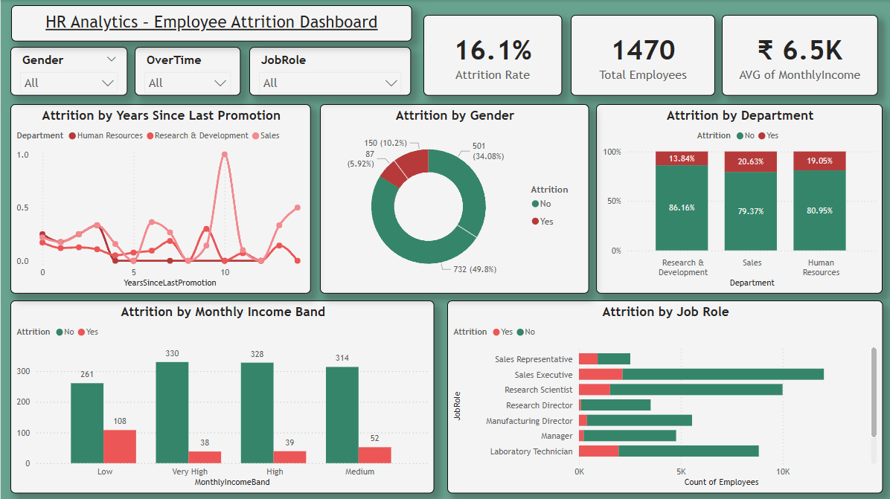

# HR-Employee-Attrition
Predict employee attrition using machine learning models, SMOTE balancing, and visualize insights in an interactive Power BI dashboard.

# HR Analytics – Employee Attrition Prediction 🚀

This project aims to predict employee attrition using machine learning and present business insights through an interactive Power BI dashboard. The analysis uses historical HR data to identify key factors that contribute to employee turnover.

---

## 📊 Project Highlights

- Exploratory Data Analysis (EDA) on gender, department, job role, and salary bands
- Handled class imbalance using SMOTE
- Built and evaluated multiple models:
  - Logistic Regression
  - Decision Tree
  - Random Forest
  - XGBoost
- Selected Logistic Regression as the final model (best F1-score with generalization)
- Developed a Power BI dashboard to visualize attrition trends

---

## 🛠️ Tools & Technologies

- Python (Pandas, NumPy, Scikit-learn, XGBoost)
- Jupyter Notebook
- SMOTE (Imbalanced-learn)
- Power BI (Dashboard)
- Matplotlib, Seaborn (Visualization)

---

## 📈 Model Performance

| Model               | Test Accuracy | Recall (Yes) | F1-Score (Yes) |
|--------------------|----------------|--------------|----------------|
| Logistic Regression (SMOTE) | 85.7%         | 0.40         | 0.47   |
| XGBoost (SMOTE)     | 86.0%         | 0.30         | 0.41           |

✅ Logistic Regression selected as final model based on balanced performance and explainability.

---

## 📊 Power BI Dashboard Preview

The dashboard includes:
- KPI cards (Attrition Rate, Avg Salary)
- Attrition by Department, Job Role, Salary Band
- Filters by Gender, OverTime, Department
- Line chart showing promotion vs. attrition trends

---

## 📄 Final Deliverables

- ✅ 2-Page Project Report PDF
- ✅ Power BI Dashboard (`.pbix`)
- ✅ Model Performance Summary & Confusion Matrix
- ✅ Attrition Prevention Suggestions (PDF)

---

## 🔚 Conclusion

This end-to-end project helps HR teams understand why employees leave and enables data-driven decisions to reduce attrition. Explore the notebook and dashboard to gain actionable insights.

---
